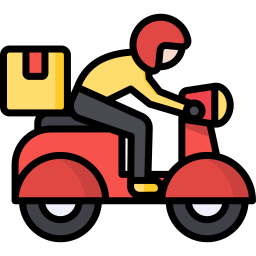

# Problem Explanation and Ranking Method

## 0. Terminology

- Delivery driver (rider)
    - A person who picks up delivery food from a store and delivers it to the customer who ordered it.
- pickup
    - A customer's order is taken over by a store.
- delivery
    - A customer's order that is picked up at a store and delivered to the customer's requested location.
- readytime
    - The time that the customer's order is ready = the time that the customer places the order (OT) + the time that the order is ready in store (RT)
- Delivery deadline - DT
    - The deadline by which the delivery must be made to the customer. Before this time, the delivery driver must reach the customer and complete the delivery of the order.
- bundle delivery
    - Bundling multiple orders together and delivering them all at once by a single delivery driver.

## 1. Problem Situation

#### 1.1. Orders

You've probably ordered food a lot, right? When you order food through a delivery app, the following order information is generated.

It is not cost-effective for one delivery person to deliver one order. Delivery companies want to bundle multiple orders occurring at similar times to reduce the number of delivery personnel needed, thereby reducing delivery costs.

- Bundle delivery is more efficient than each delivery

You are given an order list generated in a specific area.

- order list is given

However, to bundle orders for delivery, various constraints need to be considered. Let's first consider the delivery personnel who will perform the orders!

### Constraints

#### 1.2. Delivery Personnel

There are three types of delivery personnel. 



Each type has different delivery capacity, speed, service time, and cost. For example,

- Walking delivery personnel are the slowest but the cheapest for the delivery company to pay.
- Motorcycle delivery personnel are the fastest but cost the most.
- Cars have a larger delivery capacity than other delivery personnel but require more time (i.e., service time) to park.

The cost paid to delivery personnel is determined as follows:

**Delivery Cost**

> **Bundle delivery cost = fixed cost by delivery personnel type + variable cost by distance**

The fixed and variable costs differ depending on the type of delivery personnel.

> **Note!** The fixed cost by delivery personnel type is charged only once, regardless of how many orders are bundled together.

> **Note!** The variable cost is proportional to the distance! The travel time may vary due to different speeds of delivery personnel, but the variable cost is calculated based on the same distance for all types.

From the customers' perspective, the delivery fee is predetermined when they place the order, and as long as the delivery is completed before the deadline, it doesn't matter what type of delivery personnel comes. However, the delivery company will incur different costs depending on the type of delivery personnel used. Nonetheless, it is challenging to use only the cheapest delivery personnel due to limited availability.

What if we could reduce the number of required delivery personnel by bundling several orders for delivery? It would certainly reduce costs! However, several considerations need to be taken into account to perform bundle delivery.

#### 1.3. Delivery Personnel

To bundle orders for delivery, the following constraints must be met:

> **Constraint 1:** The total volume of bundled orders must not exceed the capacity of the delivery personnel: Capacity Constraint.

- Sum of allocated orders’ volume is less than or equal to capacity of the rider

> **Constraint 2:** All orders must be delivered before the delivery deadline: Time Constraint.

- DT_i is a deadline of order i → DT_i must be satisfied (hard constraints)

> **Constraint 3:** When performing bundle delivery, all pickups must be completed before any deliveries are made: Visit Order Constraint.

- The generated bundle delivery must be assigned to the delivery personnel in such a way that all orders are delivered.

#### Additional Constraints for Available Delivery Personnel

> **Constraint 4:** All orders must be delivered by a delivery personnel: Order Fulfillment Constraint

- All orders must be allocated to riders.

> **Constraint 5:** Each delivery personnel can perform at most one bundle delivery: Delivery Personnel Allocation Constraint

- Each rider can perform at most one bundle delivery.


## 2. Example

Let's consider a case where two orders are given.


The two orders in the example have two pickup locations and two delivery points. 

The distances between pickup and delivery locations are as follows:


To bundle the two orders, two constraints must be met.

<u>**Constraint 1: Capacity Constraint**</u>

For the capacity constraint, the sum of the volumes of the two orders is 90 (=40+50), making it impossible for a walking delivery personnel to deliver. 

Both motorcycle and car delivery personnel meet the capacity constraint!

Now, let's see if the time constraint is satisfied.

<u>**Constraint 2: Time Constraint**</u>

To satisfy the time constraint, the delivery personnel must:

- Depart to the next location after the ready time during pickup.
- Arrive at the delivery location before the delivery deadline minus service time.

Let's consider a scenario where the delivery is performed in the following order using a motorcycle:


Arc Numbers Represent Travel Time of the Motorcycle

A detailed explanation in delivery order:

1. **Order 1's Pickup Location:** Complete the pickup at time 15 and depart to the next location. Here, 15 is the ready time of order 1, and it is assumed that the delivery personnel has already arrived and completed all services beforehand.

   > **Note!** At the first location of bundle delivery, departure is possible after the ready time without considering the service time.

   - each rider has already arrived at first order’s pickup location (not exact)

2. **Order 2's Pickup Location:** It takes 10 time units to travel from order 1's pickup location to order 2's pickup location, given the motorcycle's speed is 2. Thus, arriving at 25 requires a service time of 3, making the departure time 28. However, order 2's ready time is 30 (order occurrence time 10 + preparation time 20), so the departure is after 30 (a waiting time of 2 occurs).

   > **Note!** The ready time is calculated as the order occurrence time + preparation time.

3. **Order 1's Delivery Location:** Depart at 30, arrive at order 1's delivery location at 70, and complete the delivery at 73 after a service time of 3. This is within the deadline of 80, so order 1 is successfully delivered.

4. **Order 2's Delivery Location:** Depart at 73, arrive at 92, and complete the delivery at 95 after a service time of 3. This is within the deadline of 95, so order 2 is successfully delivered.

<u>**Constraint 3: Visit Order Constraint**</u>

The only way to bundle the two orders is for the motorcycle delivery personnel to deliver in the above visit order. Upon close examination, it can be seen that the only way to bundle the two orders is to visit all pickup locations first and then perform all deliveries. Therefore, after completing all pickups, the delivery locations can be visited.

<u>This means that you can't go directly from the pickup location for Order 1 to the delivery location for Order 1 or Order 2.</u> 

> **Note!** After all pickups are completed, the delivery locations can be visited.

<u>**Constraint 4: Order Fulfillment Constraint**</u>

Both orders 1 and 2 have been successfully delivered, satisfying the order fulfillment constraint.

*Thus, to create a bundle delivery, the following must be determined:*

- ***Type of delivery personnel (Walking, Motorcycle, Car).*** 
- ***Order set satisfying the capacity constraint.***
- ***Visit order adhering to the time constraint.***

### Another Example

Now, let's consider another example with 10 orders (order numbers 1 to 10).

Upon checking the constraints, it is possible to bundle two orders together for delivery using either motorcycles or cars.

- **Orders 1 & 2:** Bundle delivery possible with motorcycle or car.
- **Orders 3 & 4:** Bundle delivery possible with motorcycle or car.
- **Orders 5 & 6:** Bundle delivery possible with motorcycle or car.
- **Orders 7 & 8:** Bundle delivery possible with motorcycle or car.
- **Orders 9 & 10:** Bundle delivery possible with motorcycle or car.

<u>Assume that 3 motorcycles and 10 cars are available.</u>

If the visit order of all bundle deliveries is the same for both motorcycles and cars, the travel distance is the same for all bundles. Hence, the cost of each bundle delivery is determined by the fixed and variable costs of motorcycles and cars. For simplicity, assume that motorcycles are cheaper for all bundle deliveries.

Allocate 3 out of 5 bundle deliveries to motorcycles, and the remaining 2 to cars to minimize costs.

<u>**Constraint 5: Delivery Personnel Allocation Constraint**</u>

Since each delivery personnel can perform at most one bundle delivery, the remaining 2 bundle deliveries must be assigned to car delivery personnel. Thus, when multiple types of delivery personnel can be used for bundle deliveries, the allocation must consider the number of available delivery personnel. Additionally, delivery personnel can perform only one bundle delivery at a time.

## 3. Objective Function

Once the type of delivery personnel and the visit order are determined for each bundle delivery, the cost can be calculated based on the travel distance. Summing up the costs of all bundle deliveries gives the total cost, and dividing this by the total number of orders gives the average delivery cost.

> Objective Function: Average Delivery Cost = Total Delivery Cost / Total Number of Orders

## 4. Problem Data Definition

The data for each problem includes the following:

- **`K` orders list.**
- **Types and characteristics of delivery personnel.**
- **Distance matrix.**

The problem data is provided in JSON format with the following fields:

```json
{
 "name": "TEST_K50_1",
 "K": 50,
 "RIDERS": [["BIKE", 5.291005291005291, 100, 80, 2200, 120, 5],
            ["WALK", 1.3227513227513228, 70, 50, 2200, 120, 10],
            ["CAR", 4.2328042328042335, 200, 60, 2200, 150, 50]],
 "ORDERS": [[0, 7, 37.49493567, 127.03071274, 37.501853, 127.037541, 900, 40,
             1980],
            [1, 53, 37.49246391, 127.04021194, 37.491006, 127.023683, 1200, 42,
             2489],
            [2, 95, 37.5030462, 127.05048848, 37.503553, 127.053148, 600, 28,
             1525],
            [3, 142, 37.50457363, 127.04140593, 37.507767, 127.025053, 900, 19,
             2284],
            [4, 221, 37.48549201, 127.01352012, 37.48385, 127.015403, 1800, 40,
             2853],
            [5, 391, 37.50960069, 127.0335454, 37.494084, 127.028143, 900, 20,
             2634],
            [6, 597, 37.5001711, 127.0522837, 37.499698, 127.069605, 900, 47,
            ...
            
            
 "DIST": [[0, 1236, 2753, 2001, 2586, 2312, 2789, 1809, 3978, 2126, 1551, 2312,
           3807, 2483, 1067, 1453, 4188, 1479, 2364, 10027, 3689, 1859, 7330,
           3495, 3046, 460, 3150, 1552, 2548, 3351, 5412, 3020, 2534, 3122,
           2839, 1484, 1722, 3092, 3046, 2534, 2736, 2685, 522, 3483, 4065,
           3340, 3631, 2504, 1739, 2016, 1369, 1063, 3082, 2119, 2563, 344,
           4866, 1392, 3266, 1390, 1099, 2370, 3919, 537, 4834, 2318, 5043,
           2569, 1205, 9609, 2283, 2153, 5245, 5640, 3381, 1836, 2976, 1035,
           766, 2211, 3830, 3174, 4051, 3838, 4587, 1753, 1771, 2588, 2244,
           2176, 213, 3015, 2257, 2138, 3673, 3806, 1023, 3278, 4554, 1559],
          [1236, 0, 2082, 1893, 3475, 2795, 1916, 2916, 2933, 2903, 1802, 2795,
           4676, 2654, 1264, 1693, 3627, 2660, 3542, 8791, 2502, 1572, 8409,
           4673, 1999, 1577, 4307, 445, 2105, 4261, 5164, 4021, 2884, 2078,
           4008, 1651, 1716, 3607, 1999, 2884, 1900, 1795, 1174, 3641, 5288,
           2621, 2822, 3446, 2725, 2872, 1500, 2056, 2355, 3033, 3349, 1514,
           3805, 683, 2743, 1865, 1317, 3032, 4883, 1487, 4664, 2814, 4034,
           3662, 954, 8375, 1053, 2744, 6362, 6238, 2967, 2902, 4175, 225, 954,
           1961, 3661, 3880, 3910, 3844, 5370, 2860, 2826, 2991, 1009, 3203,
           1024, 2295, 1798, 2543, 4908, 4641, 2157, 3803, 5788, 2314],
           ...
  }
```

- **name:** Problem name

- **K:** Number of orders

- **RIDERS**: information about the delivery person, e.g. `[“bike”, 5.291005291005291, 100, 80, 2200, 120, 5]`

  - Type: `BIKE`, `WALK`, or `CAR` → `“BIKE”`
  - Speed: distance (m)/time (sec) → `5.291005291005291`
  - Capacity → `100`
  - Variable cost (per 100 meters) → `80`
  -  Fixed cost → 2200
  - Approach time (seconds) → `120`
  - Availability of couriers → `5`

  > There will always be the same number of avaiable cars as the number of orders, which means that it is always possible to deliver all orders one by one by the vehicle without bundling them! Of course, this is not good for the cost!

- **ORDERS**: order information e.g. `[0, 7, 37.49493567, 127.03071274, 37.501853, 127.037541, 900, 40, 1980]`

    - Order ID → `0`
    - Order time (in seconds) → `7`
    - pickup location latitude coordinates → `37.49493567`
    - Pickup location longitude coordinates → `127.03071274`
    - Delivery Location Latitude Coordinates → `37.501853`
    - Delivery location longitude coordinates → `127.037541`
    - Order preparation time (in seconds): *PICKUP's READYTIME* → `900`, if you add the time of order creation to the time of food preparation.
    - volume of the order → `40`
    - delivery deadline (in seconds) → `1980`

- **DIST**: Distance matrix

    - `2K * 2K` matrix
    - m units (rounded to whole numbers)
    - e.g., Distance between pickup location of order `i` and pickup location of order `j` = `DIST[i,j]`
    - e.g., Distance between pickup location of order `i` and delivery location of order `j` = `DIST[i,j+K]`
    - e.g., Distance between the delivery location of order `i` and the delivery location of order `j` = `DIST[i+K,j+K]`

    > Note: Travel time is not given separately, but is calculated using the courier speed and distance.
    > You can use any integer value rounded to the nearest second! Service time can be added to the travel time to account for access time
    >
    > e.g., Python travel time conversion
    >
    > ```python
    > rider.T = np.round(dist_mat/rider.speed + rider.service_time)
    > ```

    

5. Algorithm's Solution

The algorithm should return the following solution for the given problem data:

- **A list of [type of delivery personnel, visit order of restaurants, visit order of customers] for each bundle delivery.**
- **The order of visits is defined by the order of the order IDs, such as order [1,3,2].**
- e.g., `[“BIKE”, [1,3,2], [2,3,1]]`
  - Explanation: the bundle of orders 1,2,3 together and assign them to a motorcycle delivery person, visit pickup locations in the order 1,3,2 and delivery locations in the order 2,3,1.
  - Bike: P<sub>1</sub> → P<sub>3</sub> → P<sub>2</sub> → D<sub>2</sub> → D<sub>3</sub>  → D<sub>1</sub> 


The evaluation system will verify whether the constraints are met. The submitted solution must satisfy Constraints 1, 2, and 3 for each bundle delivery, and Constraints 4 and 5 for the entire set of bundle deliveries.

## 6. Submission and evaluation of algorithms

Participating teams write their algorithms on the problems given per stage (preliminary, main, final) (revealed problems). After submitting the implemented algorithm code to the competition system, the algorithm is evaluated by running the submitted algorithm against the hidden problem. The algorithm evaluation server specifications are as follows

- AWS EC2 instance (c5.2xlarge)
- 8 Cores, Memory 16 GB, Storage 32 GB
- OS: Ubuntu 22.04 LTS

Algorithms are given a time limit to run. For example, the preliminaries will have a time limit of 1 minute per question, and the main and final rounds will have specific time limits at the start.

> The algorithmic time limit for qualifiers is 1 minute per question!

Because the specifications of the participating teams' PCs are different from the specifications of the evaluation server, the participating teams' algorithms must check the elapsed time during the algorithm execution to ensure that they do not exceed the time limit. 

In addition, algorithms submitted by participating teams are subject to the following limitations

- No external internet access during algorithm execution
- Maximum of 4 CPU cores can be used (~400% CPU utilisation)

Algorithms that violate the above constraints may be disqualified.

> Algorithm external internet usage and CPU core count are enforced by `firejail` and `cpulimit` when running the algorithm on the evaluation server. Participants' algorithms must not conflict with these two programmes

Teams can submit their algorithm once per day. A day is defined as from 0:00am to 23:59pm UTC, meaning that you can only submit once on the same day, based on the date at the moment of submission.

> You can only submit an algorithm once per day!

Submitted algorithms are run against a hidden problem on an evaluation server, and the results are aggregated at a set time (exact time to be announced). The aggregated results are reflected in a leaderboard on the contest homepage.

> Leaderboards update once a day at a set time!

All evaluations are based on the last algorithm submitted by the participating teams. 

> The most recently submitted algorithm as of evaluation time is the basis for all evaluations!

This means that just before the end of the phase, be sure to resubmit your best algorithm! Otherwise, you will be ranked based on the last algorithm you submitted.

The hidden evaluation questions will consist of questions with similar characteristics to the open questions. The number of evaluation questions in each phase will vary. For example, suppose five teams submitted algorithms and there were three hidden evaluation questions, and the results of solving the hidden questions were as follows 

- `TEAM00`
  - `prob1: obj=60, feasible`
  - `prob2: obj=121, feasible`
  - `prob3: obj=82, feasible`
- `TEAM01`
  - `prob1: obj=104, infeasible`
  - `prob2: obj=223, feasible`
  - `prob3: obj=95, feasible`
- `TEAM02`
  - `prob1: obj=141, feasible`
  - `prob2: obj=125, feasible`
  - `prob3: obj=102, feasible`
- `TEAM03`
  - `prob1: obj=80, feasible`
  - `prob2: obj=136, feasible`
  - `prob3: obj=129, feasible`
- `TEAM04`
  - `prob1: obj=183, feasible`
  - `prob2: obj=210, feasible`
  - `prob3: obj=54, feasible`

The above result is the result of the evaluation system solving the submitted algorithms against the hidden problems. Depending on the problem, we can also determine whether it is infeasible or not. Then, for problem $p$, we can calculate the following values
$$
nb_p = |\text{Team that found a better objective function for problem $p$} |
$$
In other words, $nb_p$ will have a smaller value for algorithms that find a good solution to problem $p$. Also, if the solution found is infeasible or the algorithm crashes when running, we treat it as a worst-case objective function. 

With the calculated $nb_p$ values, the points for each problem are calculated as follows.
$$
p_p = \begin{cases} \max \{0, R-nb_p\} &\text{ if solution is feasible}\\ -1 &\text{otherwise} \end{cases}
$$

> If the algorithm is infeasible to solve, times out, crashes, etc., you get a penalty score (-1) for that problem!

Where $R$ is the problem number of teams you're evaluating. Points are calculated for every question and rankings are determined based on the point totals. The table below shows the leaderboard for the example above.

| team   | nb_prob1 | p_prob1 | nb_prob3 | p_prob3 | nb_prob2 | p_prob2 | total_score | ranking |
| ------ | -------- | ------- | -------- | ------- | -------- | ------- | ----------- | ------- |
| TEAM00 | 0        | 5       | 1        | 4       | 0        | 5       | 14          | 1       |
| TEAM02 | 2        | 3       | 3        | 2       | 1        | 4       | 9           | 2       |
| TEAM05 | 3        | 2       | 0        | 5       | 3        | 2       | 9           | 2       |
| TEAM03 | 1        | 4       | 4        | 1       | 2        | 3       | 8           | 4       |
| TEAM01 | 5        | -1      | 2        | 3       | 4        | 1       | 3           | 5       |

### About numerical error when comparing objective functions (updated on 2024-07-15)

When comparing objective functions, round to the third decimal place. For example, if two objective function values are 100.122999997 and 100.123, they are rounded to 100.12 and 100.12, and are therefore accepted as the same objective function. The reason for this is to account for possible miscalculations when calculating the objective function value of the solution returned by the algorithm. (*The evaluation server will be updated to use these criteria as of 2024-07-15, so leaderboard scores after 2024-07-15 may be slightly different than before)*

### How the final presentation evaluation is reflected

Teams that advance to the final stage will be evaluated on their presentations. Presentations are ranked based on the presentation evaluation, which is reflected in the ranking in the form of additional evaluation questions. For example, if there are 9 hidden questions in the final stage, points are calculated for 9 evaluation questions in the same way as above, and the ranking from the last evaluation becomes the points for a hypothetical 10th hidden evaluation question, and the final ranking is determined by the sum of the points from the 10 questions (9 evaluation questions + presentation ranking).

>  💡 **The results of the final presentation are included in the ranking calculation in the same way as the hidden assessment questions. The number of hidden assessment questions per phase will be revealed at the beginning of each phase!


### Check algorithm source code for plagiarism

Algorithms submitted by participating teams must contain sufficient contributions from the participating teams. For example, submitting a nearly identical algorithm originally written by the same team members under multiple team names is not allowed. As detailed in [How to submit an algorithm](https://www.notion.so/df33194981c94768bd1c05f6157a8b9c?pvs=21), when submitting an algorithm, include the source of the algorithm. The source may be used later to check for plagiarism among participating teams. We recognize that it is difficult to determine whether an algorithm is unique. We assume that teams will participate in the competition in a common-sense and honorable manner. Teams whose behavior is inconsistent with this assumption may be restricted from participation as determined by the Steering Committee.
