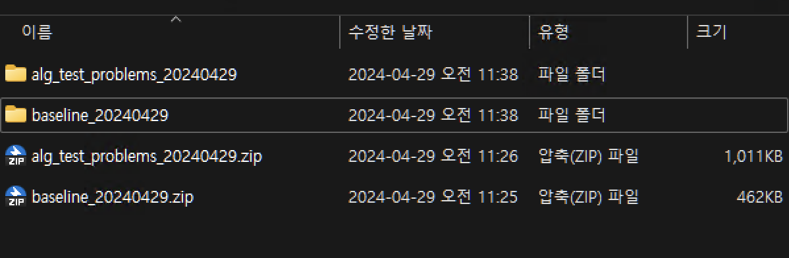
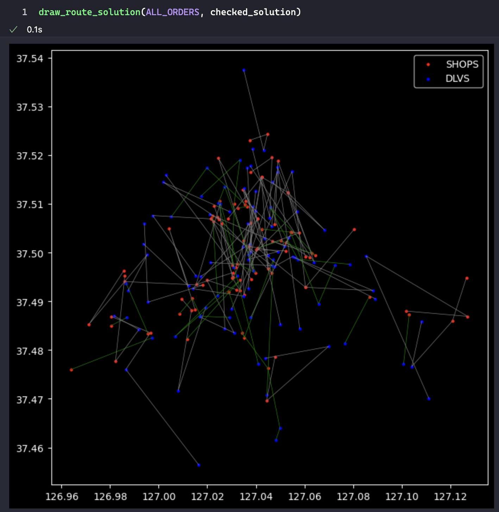
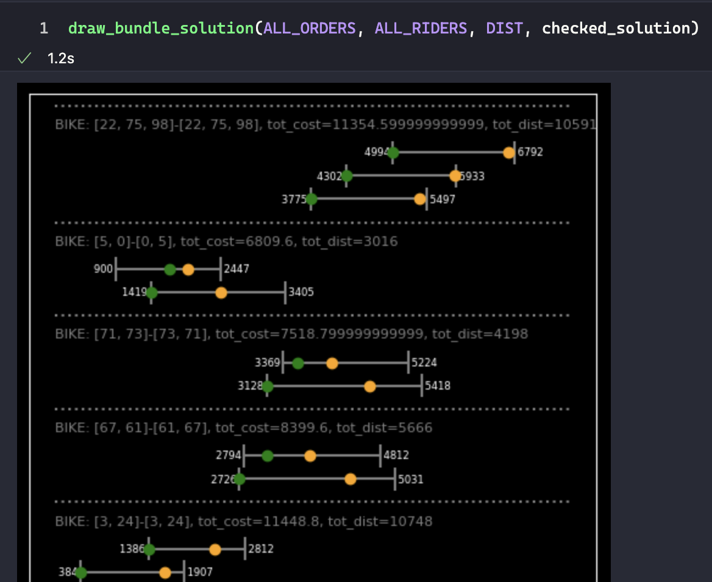

# Algorithm Development Environment and Baseline Algorithm Explanation

This page explains how to write algorithm code to enter a contest, with a baseline algorithm provided as an example. 

## 1. Algorithm Submission Method

Before submitting an algorithm, teams must first implement the algorithm on their personal computer and verify that it works. To do this, we describe the process of creating a server-like Python environment on your personal computer for evaluating algorithms. 

The following is a list of Python packages available for teams to use. Instead of installing each of these packages individually, teams can simply use the conda environment creation below to create an evaluation server-like environment.

```
- python 3.10
- jupyterlab 4.0.11
- matplotlib 3.8.4
- pandas 2.2.1
- networkx 3.1
- scipy 1.12.0
- tensorflow 2.10.0
- keras 2.10.0
- pytorch 2.2.0
- scikit-learn 1.3.0
- numba 0.59.1
- cython 3.0.10
- ortools 9.9.3963
- gurobipy 11.0.1
- xpress 9.3
```

> If there's a package you need to implement your algorithm, request it in our Slack channel and we can add it!


## 2. Conda Environment

Conda is a program that creates virtual environments. It can be installed via [Anaconda](https://www.anaconda.com/download) or [miniforge](https://github.com/conda-forge/miniforge), among others.

> Learn what Conda is and why you need it here!

[Ogc2024_env.yml]()

1. download the above file and save it to a random folder. 
2. navigate to the folder you saved.
3. Run the following in Terminal or cmd.

    `conda env create -f ogc2024_env.yml`

4. You will see the process of installing several packages. When they are all finished, run the following

    `conda activate ogc2024`

5. You're done setting up the environment when your Terminal or cmd window looks like this

[baseline_20240517.zip]()

[alg_test_problems_20240429.zip]()

First, get the above two files and unzip them in a suitable folder: `baseline_2024XXXX.zip` is a compressed file of the algorithm example code and `alg_test_problems_2024XXXX.zip` is an example problem to run the baseline code.

> alg_test_problems_2024XXXX.zip is not a preliminary problem! Problems for each phase (prelims, finals, etc.) are released at the beginning of each phase!

Extract the two zipped files as follows.



The `baseline` folder contains the following files.

- `myalgorithm.py` : <u>**The file that actually implements the algorithm. Most important!**</u>.
- `util.py`: A file that contains functions to help implement the algorithm.
- `alg_test.ipynb`: A Jupyter notebook where you can try out a simple run of the algorithm.


- `K`: the number of orders
- `all_riders`: list of delivery drivers
- `dist_mat`: distance matrix
- `timelimit`: algorithm execution time in seconds. Within this time, the algorithm should end its execution.

and

> 💡 The baseline code contains a very simple example algorithm. In the actual submission, this part should be replaced with your team's algorithm code!

> 💡 You are allowed to use or modify the baseline code, but we do not recommend submitting it as is ⇒ You can submit once per day, so please do not submit meaningless algorithms!

- Returns a list of `[delivery person type, restaurant visit order, customer visit order]` for a given problem
  - The visit order is defined as the order of the order IDs, such as order `[1,3,2]`.
  - Example) `["bike", [1,3,2], [2,3,1]]`

Satisfying the objective function and constraints is done by the scoring system. For more information, see the problem description page.

## 3. How to submit your algorithm

- Compress to one `zip` file (name the compressed file arbitrarily)
- The `myalgorithm.py` file should not be in a subfolder when extracted.
    - When unzipped, `myalgorithm.py` must exist in the top-level folder!
- If you have additional files (neural network checkpoints, etc.) that are needed to run the algorithm, pack them together. You can also create a separate folder to store additional files.
- You do not need to submit `alg_test.ipynb`.
- You can add separate Python files (modules). They must be compressed together.
- Compressed files should be 30MB or less in size (if you run out of space, ask for more in our Slack channel).

### How to use a language other than Python

It is also possible to use a language or library other than Python. Just create a compressed file with all the necessary libraries and write `myalgorithm.py` to run functions from another language.

> 💡 We recommend that you create an environment like an evaluation server through a virtual machine to check the behavior of the algorithm!

> 💡 Please include the source of any libraries you have written that will not be compiled by the evaluation server, and compress and submit them! 

> 💡To use languages such as C#, `Microsoft.NETCore.App 7.0.19` is installed, so write your algorithm based on this version! (Updated 2024-6-3)

To implement and submit an algorithm, you need to run it on a participant's PC and see the results of the algorithm. You can use `alg_test.ipynb` to do this.

> 💡The following description assumes that Jupyter notebooks are available in your environment. Jupyter notebooks are available when you install JupyterLab or Visual Studio Code.

When you open the `alg_test.ipynb` file with VSCode or JupyterLab, you'll see something like this

> 💡After opening the notebook, make sure that the Jupyter kernel is in the `ogc2024` environment! For JupyterLab, you can activate the `ogc2024` environment from cmd or Terminal first and then run `jupyter-lab`.

When you run a cell in a notebook, it executes the algorithm in the myalgorithm.py file, which is located in the same folder as the notebook. The executable code is briefly described below.

```python
problem_file = '../alg_test_problems_20240429/TEST_K100_1.json'
timelimit = 10
```

The code reads the problem file to be solved by the algorithm. The specified path `'../alg_test_problems_20240429/TEST_K100_1.json`in the example corresponds to the extracted test problems. Store the problems released at each stage and specify the file path accordingly.

```python
with open(problem_file, 'r') as f:
    prob = json.load(f)
    
K = prob['K']

ALL_ORDERS = [Order(order_info) for order_info in prob['ORDERS']]
ALL_RIDERS = [Rider(rider_info) for rider_info in prob['RIDERS']]

DIST = np.array(prob['DIST'])
for r in ALL_RIDERS:
    r.T = np.round(DIST/r.speed + r.service_time)
    
alg_start_time = time.time()
exception = None
solution = None
```

This section prepares the algorithm to solve the problem by reading the problem file. The `Rider` and `Order` class, defined in `util.py`, assist in implementing the algorithm.

>  💡 You cannot modify the functions or classes defined in `util.py`. If modifications are necessary, define new classes and functions in a separate file and use them.

```python
try:
    # Run algorithm!
    solution = algorithm(K, ALL_ORDERS, ALL_RIDERS, DIST, timelimit)
except Exception as e:
    exception = f'{e}'
```

This is where the algorithm is executed. The algorithm you wrote in `myalgorithm.py` is executed with the `algorithm(K, ALL_ORDERS, ALL_RIDERS, DIST, timelimit)` command. 

```python
lg_end_time = time.time()

with open(problem_file, 'r') as f:
    prob = json.load(f)

K = prob['K']

ALL_ORDERS = [Order(order_info) for order_info in prob['ORDERS']]
ALL_RIDERS = [Rider(rider_info) for rider_info in prob['RIDERS']]

DIST = np.array(prob['DIST'])
for r in ALL_RIDERS:
    r.T = np.round(DIST/r.speed + r.service_time)

checked_solution = solution_check(K, ALL_ORDERS, ALL_RIDERS, DIST, solution)

checked_solution['time'] = alg_end_time - alg_start_time
checked_solution['timelimit_exception'] = (alg_end_time - alg_start_time) > timelimit + 1 # allowing additional 1 second!
checked_solution['exception'] = exception

checked_solution['prob_name'] = prob['name']
checked_solution['prob_file'] = problem_file
```

In particular, the `solution_check(K, ALL_ORDERS, ALL_RIDERS, DIST, solution)` command checks if the solution of the algorithm is valid by satisfying all the constraints, and if not, provides a simple reason why. Check out the function code in `util.py` for the detailed process of checking the validity of a solution!

```json
{'total_cost': 573047.2,
 'avg_cost': 5730.472,
 'num_drivers': 50,
 'total_dist': 354962,
 'feasible': True,
 'infeasibility': None,
 'bundles': [['BIKE', [14], [14]],
  ['BIKE', [28], [28]],
  ['BIKE', [29], [29]],
  ['BIKE', [85], [85]],
  ['BIKE', [93], [93]],
  
  ...
  
  ['BIKE', [67, 61], [61, 67]],
  ['BIKE', [71, 73], [73, 71]],
  ['BIKE', [5, 0], [0, 5]],
  ['BIKE', [22, 75, 98], [22, 75, 98]]],
 'time': 9.459444999694824,
 'timelimit_exception': False,
 'exception': None,
 'prob_name': 'TEST_K100_1',
 'prob_file': '../alg_test_problems_20240429/TEST_K100_1.json'}
```

The above is the contents of `checked_solution`. The important stuff is the:

- `avg_cost`: average cost, i.e. objective function
- `feasible`: whether the solution is valid or not
- `infeasibility`: the reason why the solution is not feasible. If the solution is valid, `None`
- `timelimit_exception`: whether the time limit was respected or not
- `exception`: Exception thrown during algorithm execution. If no exception, `None`

> 💡 In `checked_solution`, only the `bundles` item is the solution returned by the algorithm (`solution = algorithm(...)`), the rest is calculated and checked separately in `solution_check()` and added. 

> 💡 The execution time of the algorithm is purely the time that the `algorithm (K, ALL_ORDERS, ALL_RIDERS, DIST, timelimit)` is executed, excluding any time spent reading the problem, `check_solution()`, etc. and must not exceed the time limit! In the example above, `'time'` represents the actual time that the algorithm was executed (based on the wall clock). Note that if the time limit is exceeded, `'timelimit_exception'` will be`True`, in which case you will get a penalty score regardless of your solution!




`draw_route_solution(ALL_ORDERS, checked_solution)` command shows the path of the algorithm's solution. 



`draw_bundle_solution(ALL_ORDERS, ALL_RIDERS, DIST, checked_solution)` command shows detailed information for each bundled delivery. In particular, you can see whether each pickup and delivery is within the time constraint.

## 4. About licensing commercial optimization solvers

> 💡 When sending the email, please include "[OGC2024] Solver License Application - Team Name" in the subject line.

> 💡 A solver company representative confirms your participation in the contest and proceeds to issue your solver license.

> 💡 For technical issues with installing and using the solver, please consult your solver representative.

